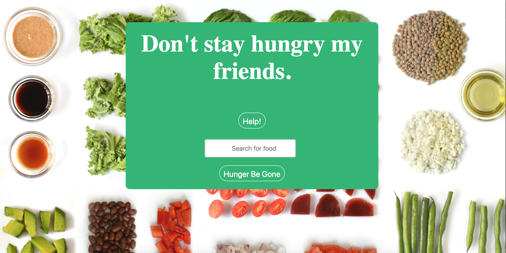
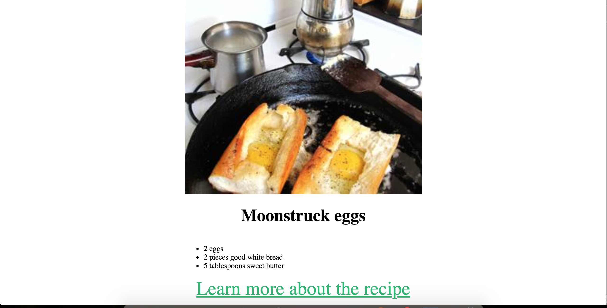

# Meal-Finder.IO
----

A application built for food lovers. Users can search for their next meal and decide if they would like to go out to eat or just make the meal at home. 

## Motivation

I love trying new food items, sometimes it is easier to make it at home while other times it is easier just go out and eat. My application delivers two different results, the ingrediants and prep time to make the meal and local restraunts that serve that meal.

## Screenshots
Start Page:
----

Maps Result Page:
----

Recipe Results:
----

## Built With Love Using:

### Front-End
* Javascript 
* jQuery 
* HTML 
* CSS

## Features

* Search for a meal 
* Look through different results 
* Look at the different types of meals that can be made with a single ingredient 
* Returns 5 different results

## Demo

- [Live Demo](https://wahidc7101.github.io/meal-finder/)

## Authors

Wahid Carvan
